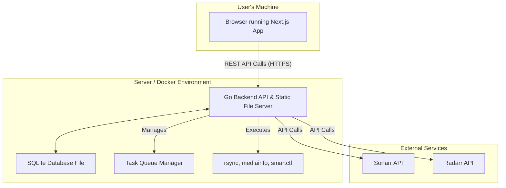

# MediaMogul Fullstack Architecture Document

## Introduction

This document outlines the complete fullstack architecture for MediaMogul, including backend systems, frontend implementation, and their integration. It serves as the single source of truth for AI-driven development, ensuring consistency across the entire technology stack. This unified approach combines what would traditionally be separate backend and frontend architecture documents, streamlining the development process for modern fullstack applications where these concerns are increasingly intertwined.

### Starter Template or Existing Project

Our strategy is to use starter templates to accelerate setup. We will use `create-next-app` for the frontend and a standard project layout for the Go backend, integrating them into our monorepo. This decision provides a best-practices foundation, allowing us to focus on feature development.

### Change Log

| Date | Version | Description | Author |
| :--- | :--- | :--- | :--- |
| 2025-08-05 | 1.0 | Initial architecture draft | Winston (Architect) |

---

## High Level Architecture

### Technical Summary

MediaMogul will be a full-stack application architected as a **monolithic Go backend** serving a REST API, and a separate, modern **Next.js (React) frontend**. Both applications will reside in a single **monorepo** for unified development. For production, these will be compiled into a **single, self-contained Docker container** where the Go binary serves both the API and the embedded frontend assets. The backend will manage an asynchronous task queue for I/O-heavy operations and will persist all application state in an **SQLite** database file, aligning with the goal of a self-contained, easy-to-deploy system for home users.

### High Level Overview

* **Architectural Style:** A decoupled frontend/backend model for development, compiled into a single binary for production. The user interacts with a dynamic Next.js single-page application (SPA) which communicates with the backend via a REST API.
* **Repository Structure:** A **Monorepo** will be used to house both the frontend and backend applications.
* **Service Architecture:** The backend will be a **Monolith**.

### High Level Project Diagram


# Architectural and Design Patterns

## Key Patterns

- **Component-Based UI:**  
  The Next.js frontend will be built as a collection of reusable, self-contained components.

- **REST API:**  
  The Go backend will expose its functionality via a stateless RESTful API.

- **Asynchronous Task Queue:**  
  A core pattern for the backend to manage long-running, I/O-heavy operations.

- **Repository Pattern:**  
  The Go backend will use the repository pattern to abstract database operations.

- **Adapter Pattern:**  
  The Integration Service will use the Adapter pattern to create a modular system for connecting to external APIs like Sonarr and Radarr, allowing for easy extension to support similar services.

---

# Tech Stack

| Category             | Technology       | Version  | Purpose                                           | Rationale                                                                 |
|----------------------|------------------|----------|---------------------------------------------------|---------------------------------------------------------------------------|
| Frontend Language    | TypeScript       | 5.4+     | Primary language for the frontend                 | Provides type safety and scalability for a complex UI                     |
| Frontend Framework   | Next.js          | 14+      | The React framework for the user interface        | Industry-standard for performant, modern React apps; required for shadcn/ui |
| UI Components        | shadcn/ui        | Latest   | Collection of UI components                       | User-specified; unstyled, accessible components for custom design         |
| State Management     | Zustand          | 4.5+     | Lightweight state management for React            | Simple, unopinionated, avoids boilerplate                                 |
| Backend Language     | Golang           | 1.22+    | Primary language for backend API and services     | User-specified; high-performance, good for concurrency                    |
| Backend Framework    | Gin              | 1.9+     | High-performance web framework for Go             | Minimalist, fast, well-documented                                         |
| Database             | SQLite           | 3.45+    | Embedded relational database                      | User-specified; ideal for self-contained single-user application          |
| Database ORM         | GORM             | 1.25+    | ORM library for Golang                            | Simplifies DB interactions, migrations, and models                        |
| API Style            | REST             | N/A      | API design paradigm                               | Well-understood, standard for frontend/backend decoupling                 |
| Authentication       | JWT              | N/A      | Token-based authentication                        | Stateless, secure, ideal for SPAs                                         |
| Frontend Testing     | Jest & RTL       | Latest   | Unit/Component testing for Next.js                | Industry standard, included with create-next-app                          |
| Backend Testing      | Go testing       | N/A      | Unit/integration testing in Go                    | Built-in, fast, and dependency-free                                       |
| E2E Testing          | Playwright       | 1.44+    | End-to-end testing framework                      | Modern, powerful for full-flow browser testing                            |
| CI/CD                | GitHub Actions   | N/A      | CI/CD pipeline                                    | Native to repository, builds and deploys Docker images                    |
| IaC & Runtime        | Docker Compose   | 2.27+    | Container orchestration for local dev             | Simple multi-container dev environment                                   |
| Logging              | Zerolog          | 1.32+    | Structured, high-performance Go logger            | Extremely fast, produces structured JSON logs                             |
| CSS Framework        | Tailwind CSS     | 3.4+     | Utility-first CSS framework                       | Required by shadcn/ui; enables efficient custom design                    |

---

# Data Models (V3.1)

## Model: MonitoredPath
- **Purpose:** Represents a top-level path that the user has configured for monitoring.
- **Key Attributes:** `id`, `path`

## Model: PhysicalDisk
- **Purpose:** Represents a unique piece of hardware associated with a monitored path.
- **Key Attributes:**  
  `id`, `path_id`, `unique_id`, `file_system`, `total_space`, `used_space`, `available_space`,
  `power_status`, `device_path`, `mount_point`, `serial_number`, `partition_guid`,
  `first_seen_ts`, `last_seen_ts`

## Model: Folder
- **Purpose:** Represents a directory on a physical disk.
- **Key Attributes:**  
  `id`, `name`, `path`, `relative_path`, `parent_folder_id`, `physical_disk_id`, `total_size`,
  `scan_version`, `is_deleted`, `modification_time_nano`, `created_time_nano`

## Model: File
- **Purpose:** Represents a single file within a folder, with metadata.
- **Key Attributes:**  
  `id`, `name`, `path`, `relative_path`, `size`, `md5`, `folder_id`, `disk_id`,
  `scan_version`, `is_deleted`, `is_missing`, `modification_time_nano`, `created_time_nano`, `accessed_time_nano`,
  `first_seen_ts`, `last_seen_ts`, `mediainfo_...`

## Model: Plan
- **Purpose:** Represents a group of tasks for a coordinated operation.
- **Key Attributes:** `id`, `name`, `status`, `created_ts`

## Model: Task
- **Purpose:** Represents an atomic background job executed by the engine.
- **Key Attributes:**  
  `id`, `plan_id`, `type`, `status`, `process_id`, `payload`,  
  `created_ts`, `scheduled_ts`, `started_ts`, `completed_ts`

## Model: History
- **Purpose:** Records an immutable log of significant events for files/folders.
- **Key Attributes:**  
  `id`, `file_id`, `folder_id`, `event_type`, `details`, `event_ts`

## Model: ScanTask
- **Purpose:** Represents queued or active disk scan operations.
- **Key Attributes:**  
  `id`, `disk_id`, `scan_type`, `execution_mode`, `status`, `priority`,
  `created_at`, `started_at`, `completed_at`, `started_at_nano`, `completed_at_nano`

---

# Database Schema

```sql
-- Represents a top-level path that the user has configured for monitoring.
CREATE TABLE monitored_paths (
    id TEXT PRIMARY KEY,
    path TEXT NOT NULL UNIQUE
);

-- Represents a unique piece of hardware that has been associated with a monitored path.
CREATE TABLE physical_disks (
    id TEXT PRIMARY KEY,
    path_id TEXT NOT NULL,
    unique_id TEXT NOT NULL,
    partition_guid TEXT NOT NULL, -- Primary identifier for disk uniqueness
    serial_number TEXT, -- Hardware serial number
    device_path TEXT NOT NULL, -- System device path (e.g., /dev/sda1)
    mount_point TEXT, -- Current mount point if mounted
    file_system TEXT,
    total_space INTEGER,
    used_space INTEGER, -- Currently used space in bytes
    available_space INTEGER, -- Available space in bytes
    power_status TEXT DEFAULT 'unknown', -- active/standby/sleep/unknown
    first_seen_ts DATETIME NOT NULL,
    last_seen_ts DATETIME,
    FOREIGN KEY (path_id) REFERENCES monitored_paths (id)
);
CREATE INDEX idx_physical_disks_unique_id ON physical_disks (unique_id);
CREATE INDEX idx_physical_disks_partition_guid ON physical_disks (partition_guid);

-- Represents a directory on a physical disk.
CREATE TABLE folders (
    id TEXT PRIMARY KEY,
    name TEXT NOT NULL,
    path TEXT NOT NULL UNIQUE,
    relative_path TEXT NOT NULL, -- Path relative to monitored root
    parent_folder_id TEXT,
    physical_disk_id TEXT NOT NULL,
    total_size INTEGER DEFAULT 0,
    scan_version INTEGER DEFAULT 1, -- For incremental scan tracking
    is_deleted BOOLEAN DEFAULT FALSE, -- Soft delete for incremental detection
    modification_time_nano INTEGER NOT NULL, -- Unix nanosecond timestamp for maximum precision
    created_time_nano INTEGER, -- Folder creation time in Unix nanoseconds (if available)
    FOREIGN KEY (parent_folder_id) REFERENCES folders (id),
    FOREIGN KEY (physical_disk_id) REFERENCES physical_disks (id)
);
CREATE INDEX idx_folders_path ON folders (path);
CREATE INDEX idx_folders_parent_folder_id ON folders (parent_folder_id);
CREATE INDEX idx_folders_physical_disk_id ON folders (physical_disk_id);
CREATE INDEX idx_folders_modification_time_nano ON folders (modification_time_nano);

-- Represents a single file within a folder, containing all collected metadata.
CREATE TABLE files (
    id TEXT PRIMARY KEY,
    name TEXT NOT NULL,
    path TEXT NOT NULL UNIQUE,
    relative_path TEXT NOT NULL, -- Path relative to monitored root
    size INTEGER,
    md5 TEXT,
    folder_id TEXT NOT NULL,
    disk_id TEXT NOT NULL, -- Reference to physical disk
    scan_version INTEGER DEFAULT 1, -- For incremental scan tracking
    is_deleted BOOLEAN DEFAULT FALSE, -- Soft delete for incremental detection
    is_missing BOOLEAN DEFAULT FALSE,
    modification_time_nano INTEGER NOT NULL, -- Unix nanosecond timestamp for maximum precision
    created_time_nano INTEGER, -- File creation time in Unix nanoseconds (if available)
    accessed_time_nano INTEGER, -- Last access time in Unix nanoseconds (if available)
    first_seen_ts DATETIME NOT NULL,
    last_seen_ts DATETIME,
    mediainfo_format TEXT,
    mediainfo_width INTEGER,
    mediainfo_height INTEGER,
    mediainfo_video_codec TEXT,
    mediainfo_audio_codec TEXT,
    FOREIGN KEY (folder_id) REFERENCES folders (id),
    FOREIGN KEY (disk_id) REFERENCES physical_disks (id)
);
CREATE INDEX idx_files_path ON files (path);
CREATE INDEX idx_files_md5 ON files (md5);
CREATE INDEX idx_files_folder_id ON files (folder_id);
CREATE INDEX idx_files_disk_id ON files (disk_id);
CREATE INDEX idx_files_modification_time_nano ON files (modification_time_nano);

-- Represents a collection of tasks grouped together by the user.
CREATE TABLE plans (
    id TEXT PRIMARY KEY,
    name TEXT,
    status TEXT NOT NULL,
    created_ts DATETIME NOT NULL
);

-- Represents a single, atomic background job to be executed by the engine.
CREATE TABLE tasks (
    id TEXT PRIMARY KEY,
    plan_id TEXT,
    type TEXT NOT NULL,
    status TEXT NOT NULL,
    process_id INTEGER,
    payload TEXT, -- Storing JSON payload as text
    created_ts DATETIME NOT NULL,
    scheduled_ts DATETIME,
    started_ts DATETIME,
    completed_ts DATETIME,
    FOREIGN KEY (plan_id) REFERENCES plans (id)
);
CREATE INDEX idx_tasks_status ON tasks (status);
CREATE INDEX idx_tasks_plan_id ON tasks (plan_id);

-- Records an immutable log of all significant events that occur to a file or folder.
CREATE TABLE history (
    id TEXT PRIMARY KEY,
    file_id TEXT,
    folder_id TEXT,
    event_type TEXT NOT NULL,
    details TEXT, -- Storing JSON details as text
    event_ts DATETIME NOT NULL,
    FOREIGN KEY (file_id) REFERENCES files (id),
    FOREIGN KEY (folder_id) REFERENCES folders (id)
);
CREATE INDEX idx_history_file_id ON history (file_id);
CREATE INDEX idx_history_folder_id ON history (folder_id);

-- Represents queued or active disk scan operations.
CREATE TABLE scan_tasks (
    id TEXT PRIMARY KEY,
    disk_id TEXT NOT NULL,
    scan_type TEXT NOT NULL, -- 'full' or 'incremental'
    execution_mode TEXT NOT NULL, -- 'opportunistic' or 'immediate'
    status TEXT NOT NULL, -- 'queued', 'running', 'completed', 'cancelled', 'failed'
    priority INTEGER DEFAULT 0, -- Task priority for queue ordering
    created_at DATETIME DEFAULT CURRENT_TIMESTAMP,
    started_at DATETIME,
    completed_at DATETIME,
    started_at_nano INTEGER, -- Scan start time in Unix nanoseconds for precision
    completed_at_nano INTEGER, -- Scan completion time in Unix nanoseconds for precision
    FOREIGN KEY (disk_id) REFERENCES physical_disks (id)
);
CREATE INDEX idx_scan_tasks_status ON scan_tasks (status);
CREATE INDEX idx_scan_tasks_disk_id ON scan_tasks (disk_id);
CREATE INDEX idx_scan_tasks_priority ON scan_tasks (priority);
```

# Components

## Key Architecture Decisions (From Epic 1 Stories)

### **Timestamp Precision Strategy**
- **All file/folder timestamps stored as Unix nanoseconds** (INTEGER fields)
- Maximum precision for accurate incremental change detection
- Browser-side timezone conversion for display
- Performance-optimized for timestamp comparisons and sorting

### **Power-Efficient Operation**
- **Database-driven browsing** - complete file exploration without disk access
- **Disk power status monitoring** before any physical operations
- **User confirmation required** before waking sleeping disks (NFR1 compliance)
- **Opportunistic operations** when disks are already active

### **Desktop-First Design**
- **Primary target resolution**: 1920x1080 and higher
- **No mobile responsiveness** - desktop browser focused
- **Grid-based layouts** optimized for desktop interaction patterns
- **Keyboard navigation support** for accessibility

### **Human-Readable Storage Display**
- **Intelligent unit scaling**: bytes → KB → MB → GB → TB
- **Smart unit selection**: 1.7 GB preferred over 1,700 MB
- **Consistent decimal precision**: 2 decimals < 10, 1 decimal 10-99, whole ≥ 100
- **Power user access**: Info buttons reveal exact bytes and all unit conversions

### **Visual Usage Indicators**
- **Color-coded usage bars**: Green < 50%, Yellow 50-80%, Red > 80%
- **Relative usage display**: Folder size as percentage of parent
- **Accessibility compliant**: Color-blind friendly with text labels

---

## Backend Components (Go Monolith)

1. **Web API (Gin):**  
   Handles all incoming HTTP requests from the frontend.

2. **Library Service:**  
   Manages all interactions with the SQLite database and contains core business logic.

3. **Scanner Service:**  
   Performs all interactions with the physical filesystem.

4. **Task Engine & Schedulers:**  
   Manages the entire lifecycle of asynchronous background jobs and audits for stale processes.

5. **Migration Service:**  
   Contains the high-level business logic for manual and automated ("SmartMover") migrations.

6. **Integration Service (Sonarr/Radarr):**  
   Handles all communication with external third-party APIs using the Adapter Pattern.

---

## Frontend Components (Next.js)

1. **API Client Service:**  
   A dedicated service layer that handles all communication with the Go Backend API.

2. **Core Views (Dashboard, File Browser, etc.):**  
   Top-level components representing the main screens of the application.

3. **Shared UI Component Library (shadcn/ui):**  
   Reusable UI "building blocks" for constructing the Core Views.

---

## Core Workflows

*(This section would contain the Mermaid diagrams for File Scan, Migration Execution, and Stale Task Auditing as previously detailed.)*

---

## Unified Project Structure

```bash
mediamogul/
├── .github/
│   └── workflows/
│       └── ci.yaml
├── apps/
│   ├── backend/
│   │   ├── cmd/server/
│   │   │   └── main.go
│   │   ├── internal/
│   │   │   ├── api/
│   │   │   ├── service/
│   │   │   └── store/
│   │   ├── go.mod
│   │   └── Dockerfile
│   └── frontend/
│       ├── app/
│       ├── public/
│       ├── package.json
│       └── Dockerfile
├── packages/
│   └── shared-types/
│       └── index.ts
├── docs/
│   ├── prd.md
│   └── front-end-spec.md
├── .gitignore
├── docker-compose.yml
├── Dockerfile.production
├── package.json
└── README.md
```

# Deployment Architecture

## Deployment Strategy

Our strategy is to produce a **single, monolithic Docker image** for production.  
A **multi-stage Docker build** will:

1. Build the **Next.js frontend** into static assets.
2. Build the **Go backend** binary.
3. Embed the static assets into the Go binary.

The end-user will only need to **pull and run one Docker container**.

---

## CI/CD Pipeline (GitHub Actions)

- Defined in: `.github/workflows/ci.yaml`  
- Steps:
  - Lint the codebase
  - Run tests
  - Build and push the Docker image

- Image Tags:
  - `:latest`
  - `:dev`

- Destination: A container registry (e.g., `ghcr.io`)

---

## Additional Sections  
*(To be included as previously detailed)*

- **Security and Performance**
- **Testing Strategy**
- **Coding Standards**
- **Error Handling & Monitoring**

---

## Checklist Results Report

### Architect Solution Validation Summary

**Final Decision:** ✅  
**Ready for Implementation:** The Fullstack Architecture Document is complete and provides a sufficient blueprint to begin development.