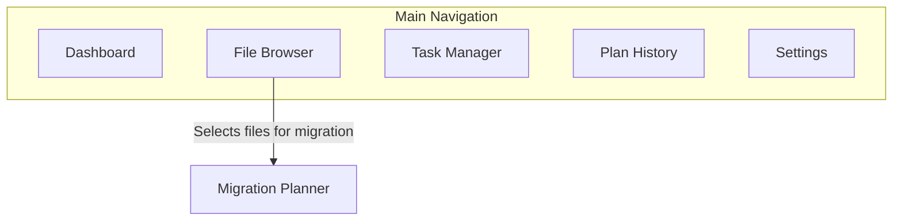

# MediaMogul UI/UX Specification

## Introduction

This document defines the user experience goals, information architecture, user flows, and visual design specifications for MediaMogul's user interface. It serves as the foundation for visual design and frontend development, ensuring a cohesive and user-centered experience.

---

## Overall UX Goals & Principles

### Target User Persona

* **"The Digital Archivist":** A tech-savvy home media server enthusiast who manages a large, ever-growing collection of media across multiple hard drives. They are meticulous about organization and data integrity. Their primary motivations are efficiency, control, and maintaining their library in a power-conscious environment. They are comfortable with complex tools but appreciate a clean, data-rich interface that helps them make informed decisions.

### Usability Goals

* **Clarity:** The interface must present complex data (disk space, task queues, file history) in a way that is immediately understandable.
* **Efficiency:** Power users should be able to perform common tasks like planning a migration or rescanning files with minimal clicks and cognitive load.
* **Control:** Users must always feel in control, with clear options to schedule, execute, and override system recommendations.
* **Safety:** Potentially destructive actions (like deletion) must be gated behind explicit user opt-ins and clear confirmations to prevent accidental data loss.

### Design Principles

1.  **Clarity Over Clutter:** Prioritize displaying the most relevant data clearly. Use progressive disclosure to hide complexity until it's needed.
2.  **Empower Through Control:** Provide smart recommendations, but always give the user the final say. The UI should be a powerful tool that serves the user's intent.
3.  **Efficiency for Power Users:** Design workflows for speed and precision, assuming a user who values managing their system effectively.
4.  **Safety by Default:** The application's default state should protect the user's data. Dangerous actions are a conscious choice, not an accident.
5.  **Respect the Hardware:** The UI should reflect the power-conscious nature of the backend, providing clear status indicators of disk activity and helping users make decisions that align with that goal.

---

## Information Architecture (IA)

### Site Map / Screen Inventory

This diagram shows the primary sections of the MediaMogul application and the main user flow from Browse files to planning a migration.


# Navigation Structure

## Primary Navigation

A persistent **top-level navigation bar** provides direct access to the five core sections of the application:

- **Dashboard**
- **File Browser**
- **Task Manager**
- **Plan History**
- **Settings**

## Secondary Navigation

Secondary navigation (e.g., tabs or a sidebar) will appear within complex sections as needed. For example, the **Settings** page will be divided into sub-sections:

- Disks
- Integrations
- Application Behavior

## Breadcrumb Strategy

**Breadcrumbs are essential for the File Browser.** A clear, clickable breadcrumb trail will always be visible, showing the user's current location within the file system hierarchy.

> *Example: Home > /mnt/disk1/ > TV Shows > Foundation (2021)*

---

# Key Screen Layouts (V4)

## 1. Data-Rich File Browser Screen

The File Browser is the user's primary window into their library. It features a **two-panel layout** designed for a comprehensive overview and detailed insights.

### Panel 1: Disk & Library Overview

- Lists the top-level monitored disks.
- For each disk, displays:
    - **Physical Disk Info:** Filesystem, Consumed/Free Space, Total Item Count.
    - **Media Library Info:** Content-aware counts such as "TV Shows: X, Seasons: Y" or "Movies: Z" (leveraging Sonarr/Radarr integration).

### Panel 2: Contents Browser & Inspector

- Displays the contents of the disk or folder selected in Panel 1.
- **Always-Visible Sizes:** Both folders and individual files show total disk space usage.
- **Proportional Usage Visualization:** Each row features a visual bar graph showing what percentage of the parent folder’s total space that item consumes (inspired by tools like TreeSize).
- **Progressive Disclosure for Details:** Detailed media metadata (video/audio codecs, languages) is accessible via a clickable “i” (information) icon next to the file name.

---

## 2. Migration Planner Screen

This screen adopts a **three-panel design** to guide the user through the migration process from left to right.

### Panel 1: Source Disk List

- Lists all disks the user can pull files from.
- Shows key info: Disk Name, Filesystem, Total Size, Free Space, Unique Identifier.

### Panel 2: Source Folders/Files

- Shows the file and folder hierarchy of the selected disk for item selection.

### Panel 3: Target Disk(s)

- Lists all available disks that can be set as the destination.
- Displays available free space and provides live feedback/warnings if the selection exceeds the target disk’s capacity.

---

# User Flows

## Flow 1: First-Time Setup & Initial Scan (V2)

**User Goal:** Configure MediaMogul for the first time and populate it with an inventory of their existing media library.

- **Entry Points:** Launching the application for the first time when the database is empty.
- **Success Criteria:** User has added their disk paths, the initial scan has completed, and both the Dashboard and File Browser are populated.

**Flow Diagram (V2):**

```graph TD
    A[Start: User opens app] --> B{Is database empty?};
    B -->|Yes| C[Redirect to Settings page];
    C --> D[User inputs a folder path];
    D --> E{Is path a root mount point?};
    E -->|Yes| F[Path added successfully];
    E -->|No| G[Show Warning Dialog];
    G --> H["Warning: MediaMogul works best when monitoring whole disks.<br/>We detected the root path is '/mnt/disk1'.<br/>Do you want to use the suggestion or continue?"];
    H --> I[Button: Use '/mnt/disk1'];
    H --> J[Button: Continue with sub-folder];
    I --> F;
    J --> F;
    F --> K[User adds more paths or proceeds];
    K --> L[User navigates to Dashboard];
    L --> M[User clicks 'Scan Everything'];
    M --> N[Confirmation Dialog];
    N -->|Confirms| O[Scan tasks queued];
    O --> P[User sees progress in Task Manager];
    P --> Q[Tasks Complete];
    Q --> R[Dashboard & Browser are now populated];
    R --> Z[End];
```

# Flow 2: Planning and Executing a Data Migration (V2)

**User Goal:**  
To create and execute a comprehensive reorganization plan, potentially involving moving files to multiple different destination disks, all within a single planning session.

**Entry Points:**  
Selecting files/folders in the File Browser and choosing _"Add to Migration Plan"_.

**Success Criteria:**  
The user successfully creates one or more migration groups on the plan canvas, executes the master plan, and can view a summary report.

**Flow Diagram (V2):**  

```graph TD
    A[Start: User selects items in File Browser] --> B[User clicks 'Add to Migration Plan'];
    B --> C[Items are added to the 'Plan Canvas'];
    C --> D{User wants to add more files?};
    D -- Yes --> A;
    D -- No --> E[User navigates to Plan Canvas UI];
    E --> F[Canvas shows all staged items, currently 'Unassigned'];
    F --> G[User creates 'Migration Group 1'];
    G --> H[User assigns a Destination Disk to Group 1];
    H --> I[User drags/assigns items from 'Unassigned' to Group 1];
    I --> J[UI shows live forecast for Group 1's Destination Disk];
    J --> K{Create another group?};
    K -- Yes --> L[User creates 'Migration Group 2', etc.];
    L --> H;
    K -- No --> M[User clicks 'Schedule All Migrations'];
    M --> N[UI presents execution options];
    N --> O[User confirms];
    O --> P[System creates a master Plan with all Groups & Tasks];
    P --> Q[Redirect to Task Manager / Plan History];
    Q --> Z[End];
```

# Flow 3: Automated Reorganization with SmartMover

**User Goal:**  
To have the application automatically generate a comprehensive data migration plan based on a chosen strategy, saving the user from the tedious task of manually selecting individual files and folders.

**Entry Points:**  
A _"SmartMover"_ or _"Auto-Plan"_ button, likely located on the Dashboard or the main Plan Canvas screen.

**Success Criteria:**  
The user successfully generates a plan using a SmartMover algorithm, reviews the proposed migration groups on the canvas, approves the plan, and schedules it for execution.

**Flow Diagram:**  

```graph TD
    A[Start: User clicks 'SmartMover' button] --> B[UI Dialog: 'Choose a Migration Strategy'];
    B --> C[User selects an algorithm:<br/>- Maximum Organization<br/>- Optimized Organization<br/>- Even-Steven<br/>- Smarter-Steven];
    C --> D[User clicks 'Generate Plan'];
    D --> E[Backend analyzes entire library based on chosen algorithm];
    E --> F[System generates a new proposed plan with multiple Migration Groups];
    F --> G[The proposed plan is loaded onto the Plan Canvas];
    G --> H[User reviews and can modify the proposed groups/moves];
    H --> I{User approves the plan?};
    I -- No --> J[User cancels or continues editing];
    I -- Yes --> K[User clicks 'Schedule All Migrations'];
    K --> L[Proceed with existing execution flow...];
```

# Flow 4: Manually Rescanning and Verifying Data

**User Goal:**  
To on-demand refresh MediaMogul's data for a specific file, a folder, or the entire library, and see the results of the scan.

**Entry Points:**  
Selecting an item in the File Browser and choosing the _"Rescan"_ option, or clicking the global _"Scan Everything"_ button.

**Success Criteria:**  
The user successfully queues a rescan task, monitors its progress, and sees the updated information or discrepancy indicators in the File Browser UI upon completion.

**Flow Diagram:**  

```
graph TD
    subgraph "Entry Point"
    A[User is in File Browser or on Dashboard]
    end

    A --> B{How to scan?};
    B -- "Targeted Scan" --> C[User selects one or more items in Browser];
    C --> D[User clicks 'Rescan' option];
    B -- "Global Scan" --> E[User clicks 'Scan Everything' button];

    D --> F[Confirmation Dialog];
    E --> F;

    F -->|User confirms| G[System queues MD5/MediaInfo tasks];
    G --> H[User can view progress in Task Manager];
    H --> I[Tasks Complete];
    I --> J[File Browser UI is updated/refreshed];
    J --> K{Discrepancy found?};
    K -- Yes --> L[Show 'discrepancy' indicator icon next to file];
    K -- No --> M[File is shown as up-to-date];
    L --> Z[End];
    M --> Z;
```

# Flow 5: Deleting Files (YOLO Mode)

**User Goal:**  
To permanently delete a file or folder from their disk using the MediaMogul interface, after having explicitly enabled this functionality.

**Entry Points:**  
The user must first enable _"YOLO Mode"_ in the Settings. Once enabled, a _"Delete"_ option appears in the File Browser.

**Success Criteria:**  
The user successfully deletes a file/folder, the action is logged in the history, and the item is removed from the UI and the physical disk.

**Flow Diagram:**  

```graph TD
    subgraph "Pre-condition"
    A[User navigates to Settings] --> B[User enables 'YOLO Mode' toggle];
    end

    B --> C[User navigates to File Browser];
    C --> D[User selects one or more items];
    D --> E[User clicks 'Delete' option];
    E --> F[Show Confirmation Dialog: 'This is permanent! Are you sure?'];
    F --> G{How to delete?};
    G -- "Delete Immediately" --> H[User confirms];
    G -- "Queue Deletion" --> H;

    H --> I[System executes or queues deletion task];
    I --> J[Task completes successfully];
    J --> K[File is soft-deleted in DB (is_deleted=true)];
    K --> L[Action is logged in History table];
    L --> M[Item disappears from File Browser UI];
    M --> Z[End];

    F -->|User cancels| C;
```

# Component Library / Design System

## Design System Approach
We will use **shadcn** as the foundation for a custom component library. We will select components from shadcn's collection, copy them into our project, and then style and adapt them to create a unique visual identity for **MediaMogul**.

---

## Core Components

- **Button**  
  Variants: Primary, Secondary/Default, Destructive  
  States: Default, Hover, Focused, Disabled

- **Checkbox**  
  Use: Selecting files and folders  
  States: Unchecked, Checked, Indeterminate

- **Tree View Component**  
  Core of the File Browser  
  Features: Collapsible nodes, selection states, icons

- **Data Card / Widget**  
  Use: Dashboard  
  Elements: Title, data value, status indicator, optional graph

- **Modal / Dialog**  
  Use: User confirmations

- **Progress Bar**  
  Use: Disk space usage, task progress

- **Input Field**  
  Use: Settings  
  States: Default, Focused, Error, Disabled

---

## Branding & Style Guide

### Visual Identity
The brand should feel **clean, technical, and data-focused**.  
A large **"Buy Me a Coffee"** button will be on the Settings page, and the footer will contain a reminder with the developer's handle `@TheLinuxGuy`.

---

### Color Palette

| Color Type | Hex Code  | Usage                                   |
|------------|-----------|------------------------------------------|
| Primary    | #3B82F6   | Main action buttons, links, active states |
| Secondary  | #6B7280   | Secondary buttons, borders                |
| Accent     | #10B981   | Highlights, positive stats                |
| Success    | #22C55E   | Success notifications, completed status  |
| Warning    | #F59E0B   | Warning dialogs                          |
| Error      | #EF4444   | Error messages, destructive actions       |
| Neutral    | #111827 - #D1D5DB | Backgrounds, panels, text         |

---

### Typography

- **Primary (UI):** Inter  
- **Monospace (Code/Data):** Fira Code

---

### Iconography

- **Icon Library:** Lucide Icons (default for shadcn)

---

### Spacing & Layout

- **Grid System:** Standard 12-column grid  
- **Spacing Scale:** 8-point spacing system (multiples of 8px)

---

## Accessibility Requirements

### Compliance Target

- **Standard:** WCAG 2.1 Level AA

### Key Requirements

- **Visual:**  
  - Color contrast ratio ≥ 4.5:1  
  - Clear focus indicators  
  - Resizable text

- **Interaction:**  
  - Full keyboard navigation  
  - Screen reader support  
  - Touch targets ≥ 44x44 pixels

- **Content:**  
  - Alt text for images  
  - Logical heading structure  
  - Labeled form inputs

---

### Testing Strategy

- Combination of automated tools (**axe**) and manual keyboard/screen reader testing

---

## Responsiveness Strategy

### Breakpoints

| Breakpoint | Min Width | Max Width | Target Devices            |
|------------|-----------|-----------|----------------------------|
| Mobile     | -         | 767px     | Smartphones (portrait)     |
| Tablet     | 768px     | 1023px    | Tablets                    |
| Desktop    | 1024px    | 1535px    | Laptops, monitors (Primary Target) |
| Wide       | 1536px    | -         | Large monitors             |

---

### Adaptation Patterns

- **Layout:** Multi-panel layouts stack vertically into single-column views on Mobile  
- **Navigation:** Primary nav collapses into hamburger menu on smaller screens  
- **Content:** Data prioritized; non-essential info collapsed by default  
- **Interaction:** Hover interactions have touch equivalents

---

## Animation & Micro-interactions

### Motion Principles

- **Purposeful and Functional:** Motion must have a clear purpose  
- **Responsive and Performant:** Animations must be smooth and fast  
- **Consistent:** Timing and style will be consistent  
- **Subtle:** Micro-interactions will be brief and non-distracting

---

### Key Animations

- **State Transitions:** Subtle press/slide effects on buttons and toggles (150ms)  
- **New Element Entry:** Gentle fade-in for new list items (200ms)  
- **Panel Navigation (Mobile/Tablet):** Slide-in transitions for stacked panels (250ms)  
- **Confirmation & Feedback:** Subtle icon animations for success/error (300ms)

---

## Performance Considerations

### Performance Goals

- **Page Load (LCP):** Under 2.5 seconds  
- **Interaction Response (INP):** Under 200ms  
- **Animation FPS:** Maintain smooth 60 fps

---

### Design Strategies

- **Lazy Loading:** Load only visible content  
- **List Virtualization:** Render only visible list items  
- **Optimistic UI Updates:** UI updates instantly, backend confirms later  
- **Code Splitting:** Only load JavaScript needed for the current view

---

## Next Steps

This document is now ready to be handed off to the Architect to begin the detailed technical planning for the frontend.

---

## Immediate Actions

- Review this completed UI/UX Specification  
- Begin creating high-fidelity mockups in Figma  
- Prepare for the handoff to the Architect

---

## Design Handoff Checklist

- [x] All user flows documented  
- [x] Component inventory complete  
- [x] Accessibility requirements defined  
- [x] Responsive strategy clear  
- [x] Brand guidelines incorporated  
- [x] Performance goals established